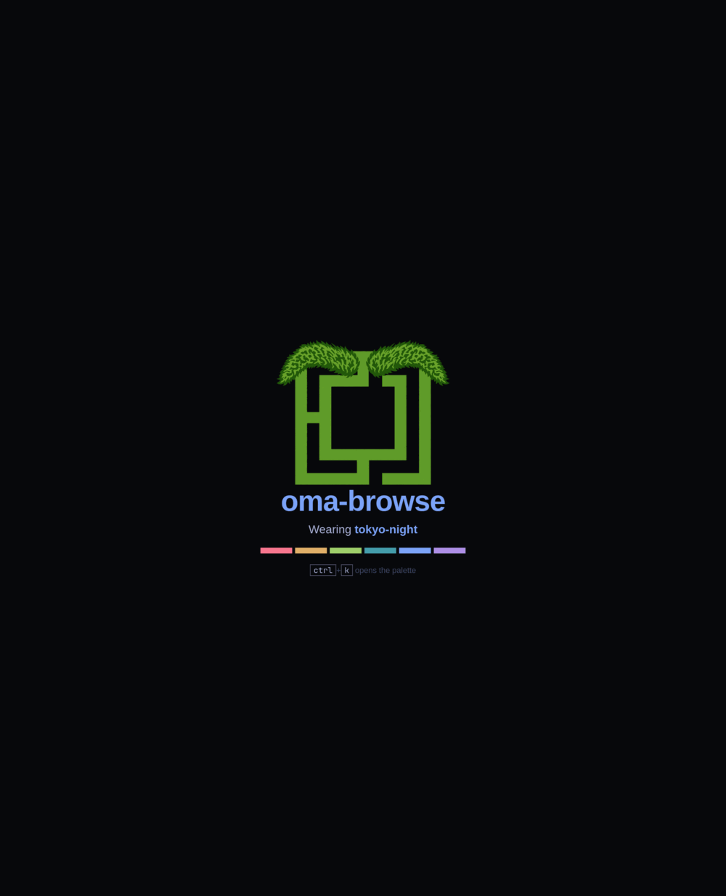

<div align="center">


# oma-browse

**An Omarchy-themed, agent-drivable browser for Linux.**<br>
Rust · Tauri · WebKitGTK



</div>

Two ideas, and everything else follows from them:

**There is no toolbar.** The page owns the window. The URL bar, the tab list,
history, bookmarks and every setting live in a command palette that is summoned
over the page and dismissed again, the way a TUI does it. The only permanent
chrome is a 26px strip of favicons at the top, and it floats — the page scrolls
underneath it.

**Every capability is one command, reachable four ways.** The palette, the
keyboard, a loopback HTTP control plane and MCP all dispatch through the same
command graph. Nothing the UI can do is unavailable to a script or an agent, and
nothing has to be implemented twice to keep it that way.

<div align="center">

</div>

---

## Features

- **Wears your Omarchy theme.** Read from disk, re-read the moment it changes —
  no restart, no D-Bus, no hook to install. Websites get it too.
- **One palette for everything.** Tabs, history, bookmarks, settings and every
  command in one list, filtered as you type, with the URL bar as the same box.
- **Drivable by anything.** Every command is an HTTP route and an MCP tool, so a
  script or an agent has exactly the browser's own vocabulary.
- **Screenshots from the engine.** WebKit paints the page into a surface itself,
  so captures work with the window on another workspace and can never grab
  something else on screen.
- **Link hints.** `f` puts a label on every link and follows the one you type;
  `F` opens it in a new tab.
- **Translucent like your terminal.** Window opacity follows Ghostty's
  `background-opacity`, or a number you pin.
- **One dotfile.** Every setting in `~/.config/oma-browse/config.toml`, next to
  the rest of an Omarchy desktop's config, and all of it optional.

> [!NOTE]
> Linux only, and Omarchy is where it is at home — but it runs on any Wayland or
> X11 desktop with GTK 3 and WebKitGTK. Without Omarchy it falls back to a
> built-in palette.

## Install

Needs GTK 3, WebKitGTK 4.1 and a Rust toolchain (see `rust-toolchain.toml`).

```sh
git clone https://github.com/douglance/oma-browse
cd oma-browse
cargo build --release
cargo install topcoat-cli               # once
topcoat asset bundle -p oma-browse      # not optional — see below
```

> [!IMPORTANT]
> The chrome is [Topcoat](https://crates.io/crates/topcoat), whose client
> runtime is bundled *out of the compiled binary* rather than shipped as a file.
> Skip `topcoat asset bundle` and the palette renders blank.

Two things worth having on the system:

| | |
|---|---|
| a **Nerd Font** | the strip's settings gear is `nf-fa-cog` |
| **gst-plugins-good** | without it WebKit has no audio sink, and media-heavy sites come up blank rather than merely silent |

## Usage

```sh
oma-browse                          # the home page — your own start page unless configured
oma-browse https://example.com      # straight to a URL
oma-browse --incognito              # forgets where it has been
```

`--private` is accepted as well, so `omarchy-launch-browser` can hand this
binary a URL and have it do the right thing.

### Keys

| | |
|---|---|
| `Ctrl-K` / `Ctrl-L` / `Ctrl-P` | palette — the URL bar, the tab list, everything |
| `Ctrl-T` / `Ctrl-W` | new tab / close tab |
| `Ctrl-N` | new window |
| `Ctrl-Shift-T` | reopen the last closed tab |
| `Ctrl-Tab` / `Ctrl-Shift-Tab` | next / previous tab |
| `Ctrl-PgDn` / `Ctrl-PgUp` | next / previous tab |
| `Ctrl-1` … `Ctrl-8` / `Ctrl-9` | jump to that tab / the last tab |
| `f` / `F` | link hints: follow, or open in a new tab |
| `Ctrl-F`, then `Ctrl-G` / `Ctrl-Shift-G` | find, next, previous |
| `Ctrl-D` | bookmark this page |
| `Alt-←` / `Alt-→` / `Alt-Home` | back, forward, home |
| `Ctrl-R`, `F5` | reload |
| `Ctrl-+` / `Ctrl--` / `Ctrl-0` | zoom |
| `F11` / `Ctrl-Shift-W` | fullscreen / close the window |
| `Esc` | dismiss the palette, or stop loading — and the page still sees it |

Keys are bound on the GTK toplevel rather than injected into the page, so they
work on a site that blocks scripts and on whatever currently holds focus. Link
hints are the exception, and deliberately: a bare letter has to be bound *in*
the page, because only the page knows whether you are typing into a search box.

`Ctrl-T` and `Ctrl-N` both come up with the palette open: a tab or a window with
nowhere to go is a question, and in a browser with no toolbar the palette is
where it gets answered. Given a URL — `tab open <url>`, `window new <url>` — both
stay quiet. A window is a second *process*, since the tab model, the palette and
the strip all belong to one window; `Ctrl-Shift-W` closes just the one you are in.

## Driving it

Type a command and it runs in the browser you were last looking at:

```sh
oma-browse tab open example.com    # opens a tab in the window you are using
oma-browse tab list                # a table in a terminal, an envelope in a pipe
oma-browse tab list --json | jq .
oma-browse page screenshot
```

Each window listens on its own Unix socket in `$XDG_RUNTIME_DIR/oma-browse`, and
`current.sock` follows whichever window has focus — so a bare command means "this
one", and `--window <pid>` means a particular one. Nothing to discover, no port
to pin: the CLI hands the window its argv, the window runs it, and you get the
output and the exit code back. With no browser running, `tab open` and
`window new` start one, and every command that needs no window (`--help`,
`theme show`, `config init`) answers on the spot.

The same commands are an HTTP API on that socket — the OpenAPI document and an
MCP endpoint included — which is what a script or an agent should talk to:

```sh
S="$XDG_RUNTIME_DIR/oma-browse/current.sock"
curl --unix-socket "$S" http://x/cmd/tab/open/example.com
curl --unix-socket "$S" http://x/cmd/tab/list
curl --unix-socket "$S" http://x/cmd/page/screenshot?path=/tmp/shot.png
curl --unix-socket "$S" --get http://x/cmd/page/eval --data-urlencode 'js=document.title'
```

```sh
oma-browse --llms          # the whole command graph, machine-readable
oma-browse mcp add         # register it with an MCP client
```

For engine-level debugging there is no protocol to reimplement: WebKit ships a
remote inspector, and it takes an address from the environment.

```sh
WEBKIT_INSPECTOR_SERVER=127.0.0.1:2999 oma-browse    # then attach a DevTools client
```

> [!NOTE]
> A socket rather than a port, because this API drives the browser and reads the
> pages you are logged in to: a filesystem permission decides who may connect,
> where a loopback port is open to every process and every account on the
> machine. The browser binds nothing at all on the network — its own chrome (the
> palette, the tab strip, the start page) is served to its own webviews over an
> `oma-chrome://` URI scheme handled inside the process.

## Theming

The browser dresses itself in the current [Omarchy](https://omarchy.org) theme,
read from `~/.local/state/omarchy/current/theme` and re-read when it changes.
Its own chrome takes the theme's tokens directly. Loaded websites get a
stylesheet injected on top of theirs: links, form controls, the caret, the focus
ring, selection and scrollbars always, and — on by default, `theme recolor off`
to stop it — neutral surfaces repainted onto the theme's ramp, leaving anything
with brand colour in it alone.

**Translucency is two settings, not one.** `[theme] veil` is how see-through a
*page* is: `"auto"` solves for contrast against your wallpaper and follows
Ghostty's `background-opacity`, so the browser is as translucent as the terminal
beside it; a number pins it whatever the wallpaper does. `[chrome] veil` is the
palette card, opaque by default because it is a card you read dense text off.
They are independent — a solid page under a glass palette is a valid answer, and
so is the reverse. `OMA_VEIL` overrules both, as the bisecting hatch.

## Configuration

Every setting lives in one dotfile, `~/.config/oma-browse/config.toml`, beside
the rest of an Omarchy desktop's config. It is entirely optional: everything has
a default, and a file with one line in it overrides one thing.

```sh
oma-browse config init    # write a commented file with every setting at its default
oma-browse config show    # the path, and every setting as the browser resolved it
```

Sections are named for the surface they affect — `[chrome]` is the browser's own
interface, `[theme]` is what loaded websites get, `[engine]` is WebKit itself:

```toml
home = ""                                       # empty = the browser's own start page
search = "https://duckduckgo.com/?q={query}"    # {query} is url-encoded

[chrome]                    # veil, font, plain_layout
[chrome.palette]            # the card's size, margins and row counts
[chrome.strip]              # enabled, height, title, debounce_ms
[theme]                     # veil, recolor
[window]                    # width, height, decorations, title
[engine]                    # javascript, devtools, user_agent, autoplay, webrtc,
                            # webgl, smooth_scrolling, font_size, cookies
[control]                   # socket
[startup]                   # incognito, restore
[history]                   # enabled, limit
[downloads]                 # dir, notify
[screenshot]                # dir, full, transparent
[tabs]                      # reopen_depth, zoom, zoom_steps, favicon_size
[keys]                      # "ctrl+k" = "ui_palette --action toggle"
```

**Keys** are remapped by chord: `"ctrl+shift+t" = "tab_reopen"`, with flags
spelled as they are on the command line (`"tab_cycle --delta -1"`), and an empty
command to unbind. Anything not named keeps its built-in binding.

A misspelled key is an error rather than silence — but not a fatal one. The
browser says which key and which line, on the log and in `config show`, and
starts on its defaults: a browser that will not open because of a typo is a
browser you cannot open the config file with. A chord that will not parse or a
command that does not exist loses that one binding and is reported the same way.
`$OMA_BROWSE_CONFIG` overrides the path, for a second profile.

Downloads land in your XDG download directory (`~/Downloads` unless
`user-dirs.dirs` says otherwise), named the way Chrome names them — `report.pdf`,
then `report (1).pdf`. `[downloads] dir` overrides it.

## Troubleshooting

| symptom | cause |
|---|---|
| the palette is blank | the asset bundle is missing — run `topcoat asset bundle -p oma-browse` |
| media sites load blank | no GStreamer audio sink — install **gst-plugins-good** |
| the strip's gear is a tofu box | no Nerd Font installed |
| a command answers *the window is not up yet* | you ran it in a second process; talk to the running browser over HTTP |
| tabs tile instead of stacking | `OMA_LAYOUT=plain` is set — that is the escape hatch for bisecting render problems |

Logs go to stderr and are filtered with `RUST_LOG`, e.g.
`RUST_LOG=oma_browse=debug oma-browse`.

## Layout

- `crates/oma-browse` — the browser: window and GTK surgery, the tab model, the
  palette and strip, the command graph, the control plane.
- `crates/oma-theme` — reads an Omarchy theme and renders it as CSS: the token
  block for our own chrome, and the runtime injected into loaded pages.

## Status

Early, and moving. It is the browser I use, which is a different bar from *it is
finished*: expect the command graph to grow and the occasional rough edge on a
site that does something unusual with its own styling.

## Acknowledgements

[Omarchy](https://omarchy.org) by DHH, whose theme format this reads and whose
taste the chrome is trying to match. Built on [Tauri](https://tauri.app),
WebKitGTK, and [Topcoat](https://crates.io/crates/topcoat) for the chrome.

## Licence

MIT. See [LICENSE](LICENSE).
