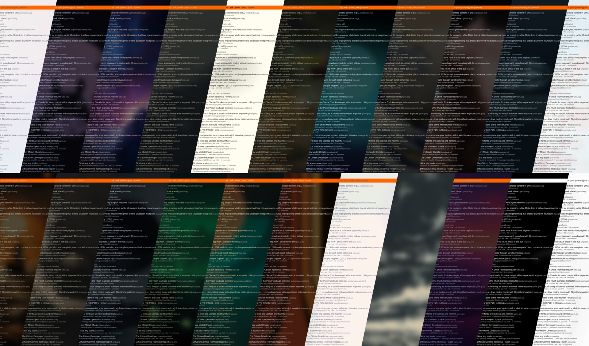
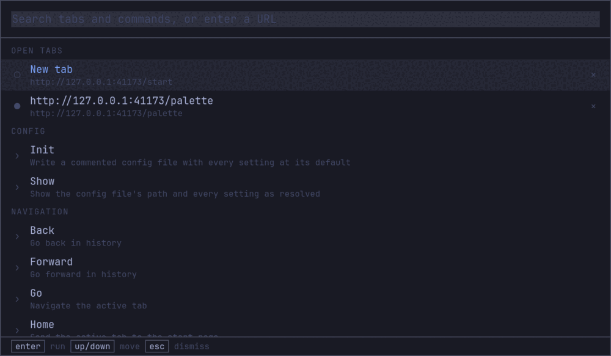

<div align="center">


# oma-browse

**A keyboard-driven browser for Omarchy.**<br>
Rust · Tauri · WebKitGTK

</div>

oma-browse is a web browser for [Omarchy](https://omarchy.org) desktops. There is no
toolbar, no tab bar and no menu button — you drive it by typing. Every action has a
keyboard chord, and all of them are also in a command palette you open with `Ctrl-K`
and filter by name, which doubles as the URL bar. The only permanent chrome is a
26-pixel strip of favicons floating over the top of the page.

It wears whatever Omarchy theme you have set — and so do the sites you visit. A
stylesheet goes in on top of every page, repainting neutral backgrounds, text and form
controls onto your theme's palette while leaving brand colour alone. Hacker News stays
orange; it stops being beige. Pages are translucent to the same degree your terminal
is, so your wallpaper shows through the web.

Every command is also a CLI, an HTTP API and an MCP server, so a shell script or a
coding agent drives the same browser you are looking at.

<div align="center">

</div>

---

## Features

- **Keyboard-first.** Every command has a chord, and the chords are Chrome's wherever
  Chrome has one. All of them are rebindable in the config file.
- **One palette for everything.** Tabs, history, bookmarks, downloads, find-on-page,
  settings and every command in a single list, filtered as you type. It is also the
  URL bar.
- **Themed, websites included.** Read from disk and re-read the moment you switch
  themes — no restart and no hook to install.
- **Translucent.** Page opacity follows Ghostty's `background-opacity`, or solves for
  contrast against your wallpaper, or is whatever number you pin.
- **Quick to open.** The start page is served from inside the process — no DNS, no TLS,
  no network — so a new window paints as fast as WebKit can start.
- **Link hints and vim keys.** `f` labels every link on the page and follows the one you
  type; `F` opens it in a new tab. `j`/`k`, `d`/`u`, `gg`/`G` scroll — and stop being
  scroll keys the moment the caret is in a text field.
- **The console and the network, in a pipe.** `page console --follow` is `tail -f` for
  everything a page logs; `page network --har` is the network panel without the panel.
  Debugging stops meaning F12 and a mouse.
- **The page as text.** `page markdown` and `page text` give you the article without the
  navigation, the cookie banner or the script tags. `page reader` shows you the same
  thing in the tab, in your theme.
- **Scriptable like Playwright.** `page click`, `page fill`, `page wait` — with waiting,
  retrying and one honest error when the element never arrives.
- **Content blocking in C++.** WebKitGTK ships Safari's content-blocker compiler, so a
  rule list is matched before a socket is opened. Pages get faster, not slower.
- **Passwords without an extension.** `page fill --from rbw|op|pass` reads the login for
  the site you are on out of the password manager you already use.
- **Profiles.** `--profile work` is a second browser: its own config, history, cookies
  and control socket, in the same binary.
- **Drivable by agents.** `oma-browse skills add` teaches your coding agent the command
  vocabulary; `oma-browse mcp add` registers the browser as an MCP server.
- **Screenshots from the engine.** WebKit paints the page into a surface itself, so
  captures work with the window on another workspace and can never catch something else
  on screen.
- **Hands pages to the desktop.** Install the current page as an Omarchy web app with
  its own launcher — one that opens *here*, chromeless, with a WM class of its own — or
  open a terminal with its URL on the clipboard.
- **Answers what pages ask for.** Camera, microphone, screen share, location and
  notifications prompt in the palette and are remembered per origin. A self-signed
  certificate gets an interstitial and `nav trust`, not a blank window; HTTP basic auth
  gets a page and `nav login`.
- **One dotfile.** Every setting in `~/.config/oma-browse/config.toml`, all of it
  optional.

> [!NOTE]
> Linux only. Built for Omarchy, but it runs on any Wayland or X11 desktop with GTK 3
> and WebKitGTK; without Omarchy it falls back to a built-in palette.

## Install

On Omarchy, or any Arch:

```sh
yay -S oma-browse-bin      # the release binary
yay -S oma-browse-git      # or build the tip yourself
```

Prefer `-bin`. Building from source compiles the WebKitGTK bindings, which takes about
ten minutes and a Rust toolchain.

<details>
<summary>From the release tarball (any distro)</summary>

No package manager involved: the tarball is the binary, the client runtime and a
desktop entry, and the binary finds the runtime by its own path — so it works from
`/usr/local` or from `~/.local` with nothing compiled in.

```sh
v=0.1.0
curl -LO https://github.com/douglance/oma-browse/releases/download/v$v/oma-browse-$v-x86_64-linux.tar.gz
curl -LO https://github.com/douglance/oma-browse/releases/download/v$v/oma-browse-$v-x86_64-linux.tar.gz.sha256
sha256sum -c oma-browse-$v-x86_64-linux.tar.gz.sha256
tar xzf oma-browse-$v-x86_64-linux.tar.gz && cd oma-browse-$v-x86_64-linux

p=~/.local                                    # or /usr/local, with sudo
install -Dm755 oma-browse "$p/bin/oma-browse"
install -Dm644 assets/* -t "$p/share/oma-browse/assets"
install -Dm644 oma-browse.desktop "$p/share/applications/oma-browse.desktop"
install -Dm644 oma-browse.png "$p/share/icons/hicolor/128x128/apps/oma-browse.png"
```

You still need GTK 3 and WebKitGTK 4.1 from your own distro's packages.

</details>

<details>
<summary>From source</summary>

Needs GTK 3, WebKitGTK 4.1 and a Rust toolchain (see `rust-toolchain.toml`).

```sh
git clone https://github.com/douglance/oma-browse
cd oma-browse
cargo build --release
cargo install topcoat-cli               # once
topcoat asset bundle -p oma-browse -r   # required — see below
```

The bundle is looked for beside the binary first and in
`$prefix/share/oma-browse/assets` second, so a build tree and an installed package both
work with no prefix compiled in.

</details>

> [!IMPORTANT]
> The chrome is built with [Topcoat](https://crates.io/crates/topcoat), whose client
> runtime is unpacked *out of the compiled binary* rather than shipped as a file. Skip
> `topcoat asset bundle` and the palette renders blank. So does running it without `-r`
> after a `--release` build: it bundles the debug binary into `target/debug/assets` and
> leaves the release tree empty.

Two things worth having on the system:

| | |
|---|---|
| a **Nerd Font** | the strip's settings gear is `nf-fa-cog` |
| **gst-plugins-good** | without it WebKit has no audio sink, and media-heavy sites come up blank rather than merely silent |

## Keys

| | |
|---|---|
| `Ctrl-K` / `Ctrl-L` / `Ctrl-P` | the palette — URL bar, tab list, everything |
| `Esc` | dismiss the palette, or stop loading |
| **Tabs** | |
| `Ctrl-T` / `Ctrl-W` | new tab / close tab |
| `Ctrl-Shift-T` | reopen the last closed tab |
| `Ctrl-Tab` / `Ctrl-Shift-Tab` | next / previous tab |
| `Ctrl-PgDn` / `Ctrl-PgUp` | next / previous tab |
| `Ctrl-1` … `Ctrl-8` / `Ctrl-9` | jump to that tab / the last tab |
| `Ctrl-M` | mute this tab |
| **Navigation** | |
| `Alt-←` / `Alt-→` / `Alt-Home` | back / forward / home |
| `Ctrl-R`, `F5` | reload |
| `f` / `F` | link hints: follow, or open in a new tab |
| `j` / `k` | scroll down / up |
| `d` / `u` | scroll half a page down / up |
| `gg` / `G` | top / bottom |
| `Ctrl-F`, then `Ctrl-G` / `Ctrl-Shift-G` / `F3` | find on page, next, previous |
| **The page** | |
| `Ctrl-+` / `Ctrl--` / `Ctrl-0` | zoom in / out / reset |
| `Ctrl-D` | bookmark this page |
| `Ctrl-U` | view source |
| `Ctrl-Shift-P` | print to PDF |
| `Ctrl-J` | open the last download |
| `F12` / `Ctrl-Shift-I` | WebKit inspector |
| **Windows** | |
| `Ctrl-N` / `Ctrl-Shift-W` | new window / close window |
| `F11` | fullscreen |

Keys are bound on the GTK window rather than injected into the page, so they work on a
site that blocks scripts and whatever currently has focus. The bare letters are the
exception — link hints and the scroll keys — because only the page knows whether you are
typing into a search box. In a text field, `j` is a `j`.

`Ctrl-D` and `Ctrl-U` are not the scroll keys here: they are already *bookmark* and
*view source*, and they are bound on the window, so a page could not see them anyway.
The bare `d` and `u` are Vimium's own half-page keys.

`Ctrl-T` and `Ctrl-N` land on the start page with the palette already up, since a new
tab needs a destination. Given one — `tab open <url>`, `window new <url>` — they stay
quiet. Each window is its own process, so `Ctrl-Shift-W` closes only the one you are in.

Rebind anything by chord in the config file:

```toml
[keys]
"ctrl+p" = "page_print"      # Chrome's placement, instead of a palette summon
"ctrl+j" = ""               # unbind
```

## The palette

`Ctrl-K` opens one list containing your open tabs and all 70 of the browser's commands,
filtered as you type. Enter on a tab switches to it. Enter on a command runs it, or opens a prompt for
its arguments if it needs any. Typing something that is neither runs it as a URL or a
search.

Commands are grouped by what they touch: `tab`, `nav`, `page`, `find`, `history`,
`bookmark`, `download`, `share`, `permission`, `content`, `theme`, `window`, `ui`,
`config`.

<div align="center">

</div>

## Theming and transparency

The browser reads the current Omarchy theme from
`~/.local/state/omarchy/current/theme` and re-reads it when it changes. Its own chrome
uses the theme's tokens directly. Loaded websites get a stylesheet on top of theirs:
links, form controls, the caret, focus rings, selection and scrollbars always, and
neutral surfaces repainted onto the theme's ramp by default. Anything with brand colour
in it is left alone. `theme recolor off` turns the repainting off for a site that does
not survive it.

Page transparency and palette transparency are set separately. `[theme] veil` controls
how see-through a *page* is: `"auto"` solves for contrast against your wallpaper and
follows Ghostty's `background-opacity`, so the browser is as translucent as the terminal
next to it, and a number pins it instead. `[chrome] veil` controls the palette card,
which is opaque by default because it holds dense text. `OMA_VEIL` overrides both.

## Driving it from a script or an agent

Type a command and it runs in the browser you were last looking at:

```sh
oma-browse tab open example.com
oma-browse tab list                # a table in a terminal, structured in a pipe
oma-browse tab list --json | jq .
oma-browse page screenshot
```

Each window listens on its own Unix socket in `$XDG_RUNTIME_DIR/oma-browse`, and
`current.sock` follows whichever window has focus. A bare command means "this one";
`--window <pid>` names a particular one. The CLI sends the window its argv and your
working directory, so `page screenshot --path shot.png` writes the file next to you
rather than next to the browser.

With no browser running, `tab open` and `window new` start one. Commands answered by a
file rather than a window — `--help`, `history list`, `bookmark list`, `config show` —
answer on the spot. Anything under `tab`, `nav`, `page`, `ui`, `find`, `window` or
`share` needs a window, and exits non-zero saying so rather than returning an empty
result.

The same commands are an HTTP API on that socket, with an OpenAPI document and an MCP
endpoint alongside:

```sh
S="$XDG_RUNTIME_DIR/oma-browse/current.sock"
curl --unix-socket "$S" http://x/cmd/tab/open/example.com
curl --unix-socket "$S" http://x/cmd/tab/list
curl --unix-socket "$S" http://x/cmd/page/screenshot?path=/tmp/shot.png
curl --unix-socket "$S" --get http://x/cmd/page/eval --data-urlencode 'js=document.title'
```

An HTTP or MCP request carries no working directory, so a relative `path` is refused
there rather than resolved against the browser's own. Give an absolute one.

### The dev loop

The commands that exist because this is a browser for people who build the web:

```sh
oma-browse page console --follow        # tail -f for everything the page logs
oma-browse page console --level error   # just what went wrong, once
oma-browse page network --failed        # every request that 404'd or blew up
oma-browse page network --har --path /tmp/run.har
oma-browse page markdown | jq -r .content | glow   # the article, no chrome
oma-browse page wait --selector '#app' && oma-browse page click 'button.save'
oma-browse page fill '#search' 'query' && oma-browse page wait --text 'results'
oma-browse nav reload --hard            # ignore the cache
oma-browse tab open :3000               # a bare port is your dev server
oma-browse window resize 375x812        # check a layout at a phone's width
```

`page console` catches every `console.*` call, every uncaught error and every unhandled
rejection from the moment the tab opened — the console is patched at document start, and
the originals still run, so the inspector shows exactly what it always showed.
`page network` is WebKit's own view of the requests, so it includes the document, the
stylesheets and the images, not only what `fetch` was involved in.

Live reload needs no feature at all — it is one line of `watchexec`:

```sh
watchexec -e rs,html,css -- oma-browse nav reload
```

`page wait` is the one worth knowing about: with no flags it waits for the load to
finish *and* for the requests to stop, which on a single-page application is the
difference between "the document is ready" and "the app has actually drawn".

### Passwords

WebKitGTK has no extension API, so 1Password's and Bitwarden's extensions cannot run
here. Their command-line clients can:

```sh
oma-browse page fill '#password' --from rbw
oma-browse page fill '#email' --from rbw --field username
oma-browse page fill '#password' --from pass --entry work/github
```

The entry is the page's host with any `www.` taken off, unless `--entry` names one.
`rbw`, `op` and `pass` are all understood. The secret goes from the vault into one
`page eval` and nowhere else — it is never in the answer, in a log, or on a command
line, and nothing is remembered or offered to be saved.

### Web apps

`--app <url>` opens one site's window: no tab strip, no palette in your face, and a WM
class of its own so a Hyprland rule can name it.

```sh
oma-browse --app https://app.slack.com     # class: oma-browse-app-app-slack-com
oma-browse share webapp                    # install the current page as a launcher
```

`share webapp` writes an Omarchy launcher that opens *here*. Without it,
`omarchy-webapp-install` writes one that runs `omarchy-launch-webapp`, whose browser
allowlist is Chromium-family only — so "install this page as an app" from this browser
used to install a launcher that opened Chrome.

### Profiles

```sh
oma-browse --profile work https://mail.example.com
oma-browse --profile work tab list          # talks to the work window, not the last one
```

A profile moves four things at once, and it has to be all four: the config file
(`~/.config/oma-browse/profiles/work.toml`), the state directory, the control socket
directory, and WebKit's own data directory — which is the one that actually holds the
cookies. Two profiles share no logins. The default profile's paths are exactly what they
always were, so nothing moves when you start using this.

### For coding agents

Install the skill files so your agent knows the command vocabulary without being told:

```sh
oma-browse skills add      # sync skills to Claude Code and friends
oma-browse skills list     # what is installed where
```

Then register the browser as an MCP server. `oma-browse --mcp` speaks MCP on stdin and
stdout and relays to the window you were last looking at, so a tool call opens a tab in
the browser you can see. With no browser running it starts one, since an MCP client has
no way to ask you to launch it first.

```sh
oma-browse mcp add         # register with an MCP client
oma-browse --llms          # or the whole command graph, machine-readable
```

### Over a port

Tooling that cannot open a Unix socket — something in a container, or on another machine
through a tunnel — can ask for a loopback port instead. It is off by default:

```toml
[control]
remote_port = 7788
```

```sh
curl http://127.0.0.1:7788/json/list                    # the live windows
curl http://127.0.0.1:7788/cmd/tab/list                 # this one
curl "http://127.0.0.1:7788/cmd/tab/list?window=<pid>"  # another one
```

That port carries the command graph and its MCP endpoint and nothing else; the palette
is not on it.

> [!NOTE]
> The default is a socket rather than a port because this API drives the browser and
> reads the pages you are logged in to. A filesystem permission decides who may connect,
> where a loopback port is open to every process and every account on the machine. The
> browser binds nothing on the network by default: its own chrome is served to its own
> webviews over an `oma-chrome://` URI scheme handled inside the process.

For engine-level debugging, WebKit's remote inspector takes an address from the
environment:

```sh
WEBKIT_INSPECTOR_SERVER=127.0.0.1:2999 oma-browse    # then attach a DevTools client
```

## Making it your default browser

`xdg-open`, link handlers and application launchers resolve a browser through a
`.desktop` file:

```sh
cargo build --release
install -Dm755 target/release/oma-browse ~/.local/bin/oma-browse
install -Dm644 assets/oma-browse.desktop ~/.local/share/applications/oma-browse.desktop
install -Dm644 assets/icon.png ~/.local/share/icons/hicolor/128x128/apps/oma-browse.png
update-desktop-database ~/.local/share/applications
xdg-settings set default-web-browser oma-browse.desktop
```

A URL opened that way lands in the window you already have, as a new tab. The `.desktop`
file's *New Window* and *New Incognito Window* actions are how you ask for a second one,
as is `Ctrl-N`.

```sh
oma-browse                          # your home page
oma-browse https://example.com      # straight to a URL
oma-browse --incognito              # forgets where it has been
```

`--private` is accepted too, so `omarchy-launch-browser` can hand this binary a URL.

## Configuration

Every setting lives in `~/.config/oma-browse/config.toml`. It is entirely optional:
everything has a default, and a file with one line in it overrides one thing.

```sh
oma-browse config init    # write a commented file with every setting at its default
oma-browse config show    # the path, and every setting as the browser resolved it
```

Sections are named for the surface they affect — `[chrome]` is the browser's own
interface, `[theme]` is what loaded websites get, `[engine]` is WebKit itself:

```toml
home = "https://omarchy.org"                    # "" for the browser's own start page
search = "https://duckduckgo.com/?q={query}"    # {query} is url-encoded

[chrome]                    # veil, font, plain_layout
[chrome.palette]            # the card's size, margins and row counts
[chrome.strip]              # enabled, height, title, debounce_ms
[theme]                     # veil, recolor
[window]                    # width, height, decorations, title
[engine]                    # javascript, devtools, user_agent, autoplay, webrtc,
                            # webgl, smooth_scrolling, font_size, cookies, trust,
                            # proxy, spellcheck, spellcheck_languages
[content]                   # block, rules
[control]                   # socket, remote_port
[startup]                   # incognito, restore
[history]                   # enabled, limit
[downloads]                 # dir, notify
[screenshot]                # dir, full, transparent
[tabs]                      # reopen_depth, zoom, zoom_steps, favicon_size
[keys]                      # "ctrl+k" = "ui_palette --action toggle"
```

A misspelled setting or key is reported rather than ignored: the browser names the key
and the line in the log and in `config show`, drops that one line, and starts on its
defaults for it. `$OMA_BROWSE_CONFIG` overrides the path outright; `--profile <name>`
is the supported way to keep a second one.

Three `[engine]` keys are worth calling out:

```toml
[engine]
trust = ["*.test", "localhost"]     # certificates accepted however broken
proxy = "http://127.0.0.1:8080"     # everything through mitmproxy or Burp
spellcheck = true                   # needs a hunspell dictionary installed
```

`trust` is the whole certificate check turned off for those names, so put nothing in it
you did not issue the certificate for yourself. Everything else gets an interstitial
naming the host and what was wrong with it, and `nav trust` is the way past it once.

### Content blocking

WebKitGTK ships the same content-blocker engine Safari uses: a JSON rule list is
compiled once into bytecode, and after that every request is matched in C++ before a
socket is opened. Nothing is fetched and then hidden, which is what an extension-based
blocker does and why it costs so much.

No list ships with the browser. Install one, then point at it:

```sh
curl -Lo ~/.config/oma-browse/easylist.json \
  https://easylist-downloads.adblockplus.org/easylist_min_content_blocker.json
```

```toml
[content]
block = true
rules = ["~/.config/oma-browse/easylist.json"]
```

```sh
oma-browse content list      # what is blocking, and what could not be read
oma-browse content reload    # after editing a list
oma-browse content off       # stop blocking in this tab; reload to see it
oma-browse content on
```

Paths, not URLs — fetching one would mean a TLS stack in this binary to do a job `curl`
already does, once, before the browser starts. The first compile takes a few seconds and
is cached in `$XDG_CACHE_HOME/oma-browse/filters`; after that it is a load. A blocked
request never reaches `page network`, because WebKit stops it before the engine reports
it.

### Permissions

Camera, microphone, screen share, location and notifications ask in the palette and are
remembered per origin:

```sh
oma-browse permission list
oma-browse permission allow https://meet.google.com camera microphone
oma-browse permission deny https://example.com notifications
oma-browse permission forget https://example.com
```

Downloads land in your XDG download directory (`~/Downloads` unless `user-dirs.dirs`
says otherwise), named the way Chrome names them — `report.pdf`, then `report (1).pdf`.
`[downloads] dir` overrides it.

## Troubleshooting

| symptom | cause |
|---|---|
| the palette is blank | the asset bundle is missing — run `topcoat asset bundle -p oma-browse` (add `-r` if you built with `--release`) |
| media sites load blank | no GStreamer audio sink — install **gst-plugins-good** |
| the strip's gear is a tofu box | no Nerd Font installed |
| a command answers *the window is not up yet* | you ran it in a second process; talk to the running browser over HTTP |
| tabs tile instead of stacking | `OMA_LAYOUT=plain` is set — the escape hatch for bisecting render problems |
| `content list` is empty just after launch | a first compile takes a few seconds and runs in the background; ask again |
| a blocklist blocks nothing | `content list` names any rule file it could not read; the file must be Safari content-blocker JSON, not an EasyList `.txt` |
| `spellcheck = true` underlines nothing | no dictionary installed — WebKit checks through enchant, which needs a **hunspell** language pack |
| `window resize` changes nothing | the compositor is tiling that window; float it first (`SUPER + V` in a stock Omarchy) |
| an incognito tab is logged out of a site the previous incognito tab was signed into | each incognito tab gets its own ephemeral WebKit context; Tauri offers no way to share one between webviews |

Logs go to stderr and are filtered with `RUST_LOG`, e.g.
`RUST_LOG=oma_browse=debug oma-browse`.

## Layout

- `crates/oma-browse` — the browser: window and GTK surgery, the tab model, the palette
  and strip, the command graph, the control plane.
- `crates/oma-theme` — reads an Omarchy theme and renders it as CSS: the token block for
  the browser's own chrome, and the runtime injected into loaded pages.

## Development

Hooks live in `.githooks/` and are opt-in per clone. One line, once:

```sh
git config core.hooksPath .githooks
```

**pre-commit** checks that `assets/mark.png` and `assets/icon.png` are still tracked —
`server.rs` embeds them with `include_bytes!` — then runs `cargo fmt --all --check`. It
skips rustfmt when nothing Rust-shaped is staged, so a README commit costs nothing.
Around 0.2s.

**pre-push** runs the slow half of CI: `cargo clippy --workspace --all-targets -- -D
warnings`, the test suite, and `node --check` on the two JavaScript runtimes the binary
injects. Those are `include_str!` strings to Rust, so a syntax error in one compiles,
ships and silently never runs; the only symptom is a page that stays unthemed, or `f`
that stops drawing link hints. Around 17s warm.

Both hooks honour `--no-verify`, and `OMA_SKIP_HOOKS=1` does the same for a script that
cannot pass the flag.

## Status

Early, and moving. Expect the command graph to grow and the occasional rough edge on a
site that does something unusual with its own styling.

## Acknowledgements

[Omarchy](https://omarchy.org) by DHH, whose theme format this reads and whose taste the
chrome is trying to match. Built on [Tauri](https://tauri.app), WebKitGTK, and
[Topcoat](https://crates.io/crates/topcoat).

## Licence

MIT. See [LICENSE](LICENSE).
